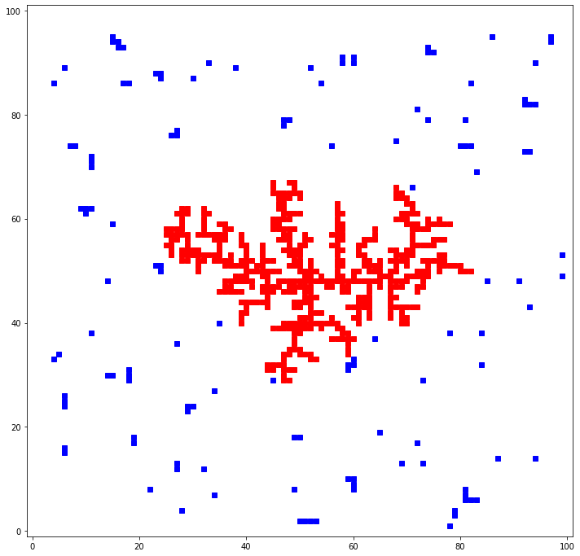

# Snowflake
goal: simulation of snowflake formation

inspired by https://www.youtube.com/watch?v=TU3IQRV6LV0

result:

update: after I finished the simulation above, I looked up how scientists actually study snowflake growth and it turns out this kind of formation is called [Diffusion-limited aggregation](https://en.wikipedia.org/wiki/Diffusion-limited_aggregation) and doesn't tell the whole story of how snowflakes are formed but generally approximates [Brownian motion](https://en.wikipedia.org/wiki/Brownian_motion) very well.
